# Complete SEO Training Guide: From Basics to Advanced Optimization

## Table of Contents
1. [Introduction to SEO Fundamentals](#introduction)
2. [How Search Engine Crawlers Work](#crawlers)
3. [SEO Priority Hierarchy System](#priority-hierarchy)
4. [Yoast SEO Setup & Configuration](#yoast-setup)
5. [Advanced Content Optimization](#content-optimization)
6. [Technical SEO Implementation](#technical-seo)
7. [AI-Powered Content Creation](#ai-content)
8. [Link Building & Optimization Strategies](#link-building)
9. [SEO Writing: From Vague to Specific](#seo-writing)
10. [Implementation Roadmap](#implementation)

---

## Introduction to SEO Fundamentals {#introduction}

Search Engine Optimization (SEO) is the practice of optimizing websites to rank higher in search engine results pages (SERPs). This comprehensive guide covers everything from basic setup to advanced optimization techniques.

### Key SEO Principles
- **Content Quality**: Create valuable, unique content that serves user intent
- **Technical Excellence**: Ensure your website is crawlable and fast
- **Authority Building**: Develop trustworthy backlink profiles
- **User Experience**: Focus on what users actually want and need

---

## How Search Engine Crawlers Work {#crawlers}

### The Crawler System Flow

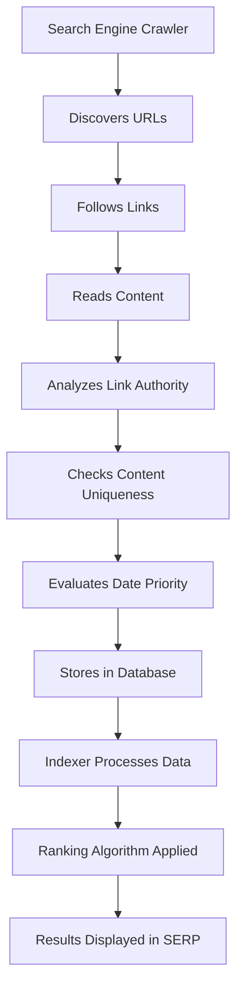

### Critical Crawler Rules

#### URL Variations Treatment
- `https://example.com` ≠ `https://www.example.com`
- **Best Practice**: Use 301 redirects to consolidate versions
- **Avoid**: Multiple URL versions causing duplicate content

#### Link Authority Analysis Process

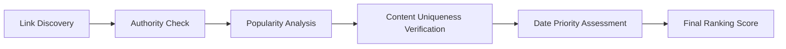

#### Reciprocal Linking Penalties (Post-2016)

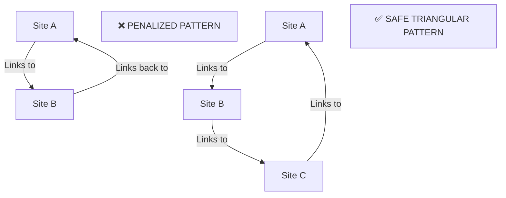

---

## SEO Priority Hierarchy System {#priority-hierarchy}

### Domain Priority Ranking

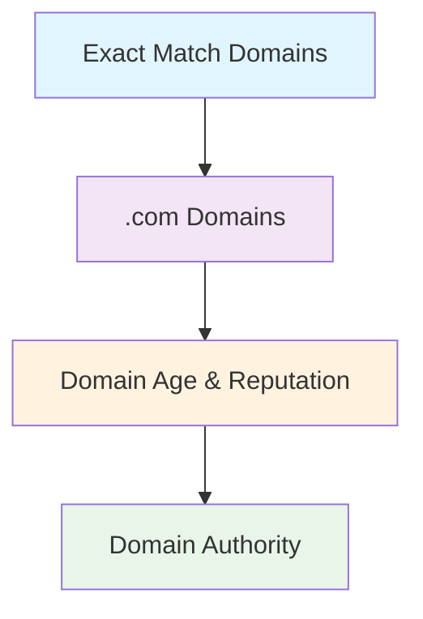

### Content Type Priority Hierarchy

| Priority Level | Content Type | Crawler Preference |
|---|---|---|
| **Highest** | Static HTML | 95% |
| **High** | Server-Rendered (WordPress) | 85% |
| **Lowest** | JavaScript/SPA | 65% |

### HTML Tag SEO Value Hierarchy

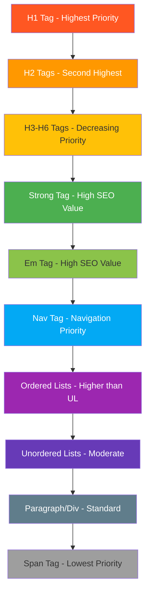

---

## Yoast SEO Setup & Configuration {#yoast-setup}

### Initial Setup Workflow

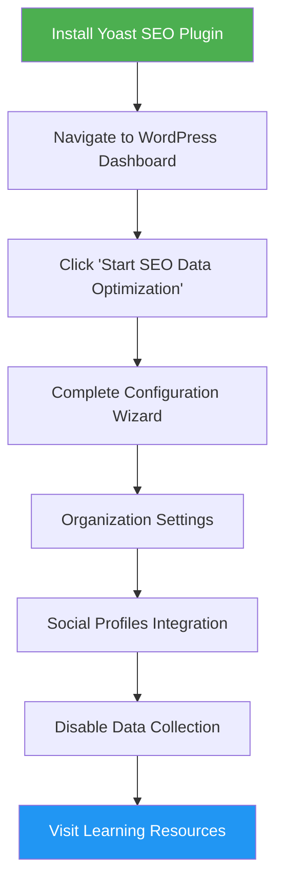

### Organization Settings Checklist

- **Website Name**: Include target keywords (e.g., "Top 5% Asian Talent")
- **Organization Name**: Use actual business name
- **Organization Logo**: Upload high-quality logo for brand recognition
- **Social Profiles**: Add all social media URLs (LinkedIn, YouTube, etc.)

### Global SEO Configuration

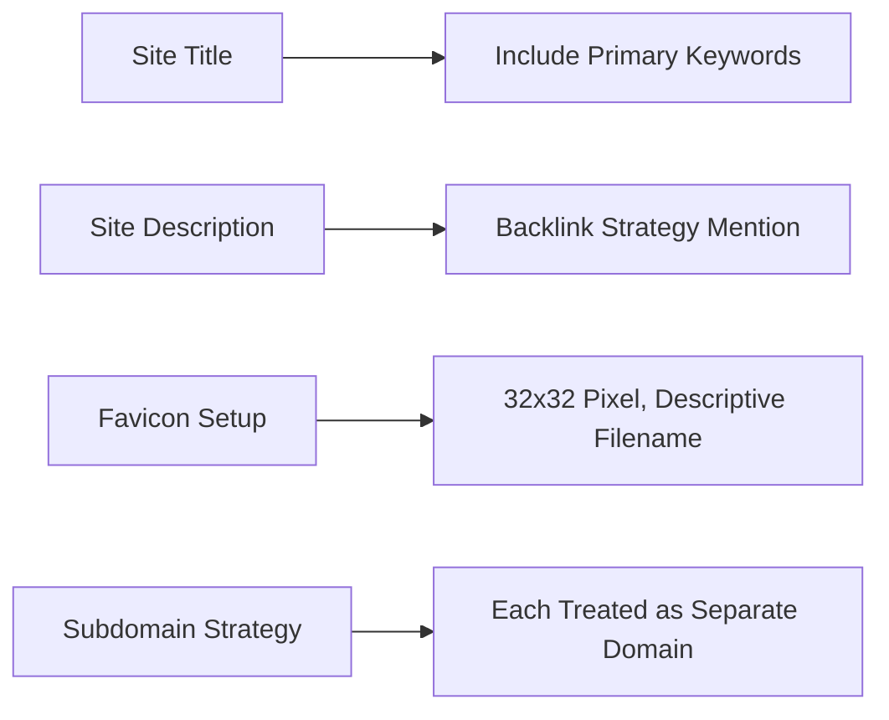

---

## Advanced Content Optimization {#content-optimization}

### Image SEO Optimization Process

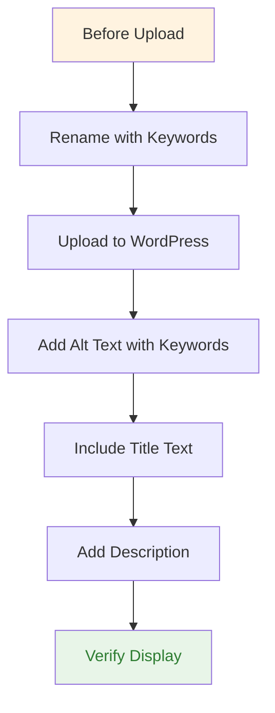

### Image Optimization Elements Priority

| Element | Importance | Best Practice |
|---|---|---|
| **Alt Text** | Critical | Include target keywords naturally |
| **Title Text** | High | Descriptive with location keywords |
| **Filename** | High | Keyword-rich before upload |
| **Description** | Medium | Comprehensive context |

### Page-Level SEO Optimization

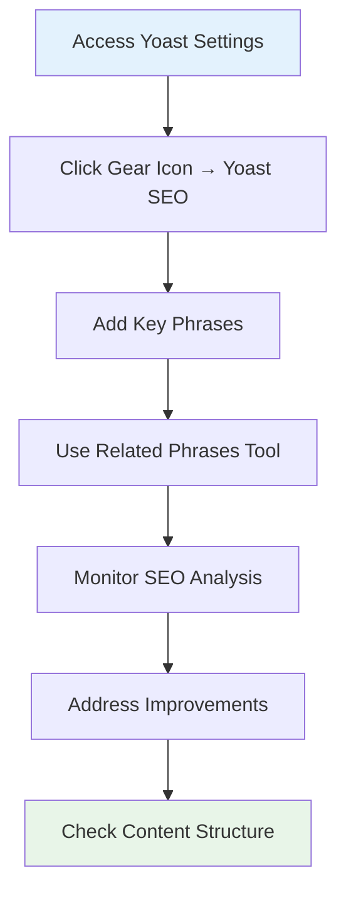

---

## Technical SEO Implementation {#technical-seo}

### Technical SEO Checklist

#### Page-Level Requirements
- [ ] Unique, descriptive page titles
- [ ] Meta descriptions (150-160 characters)
- [ ] Proper heading structure (H1, H2, H3)
- [ ] Internal linking strategy
- [ ] External authoritative links
- [ ] Image optimization (alt text, file names)
- [ ] URL structure optimization

#### Site-Level Requirements
- [ ] XML sitemap generation
- [ ] Robot.txt optimization
- [ ] Page loading speed optimization
- [ ] Mobile responsiveness
- [ ] SSL certificate installation
- [ ] Schema markup implementation

### Content Quality Assessment Framework

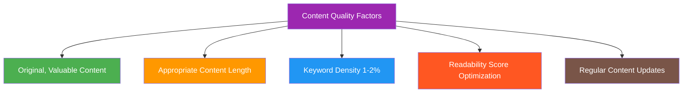

---

## AI-Powered Content Creation {#ai-content}

### AI Content Creation Workflow

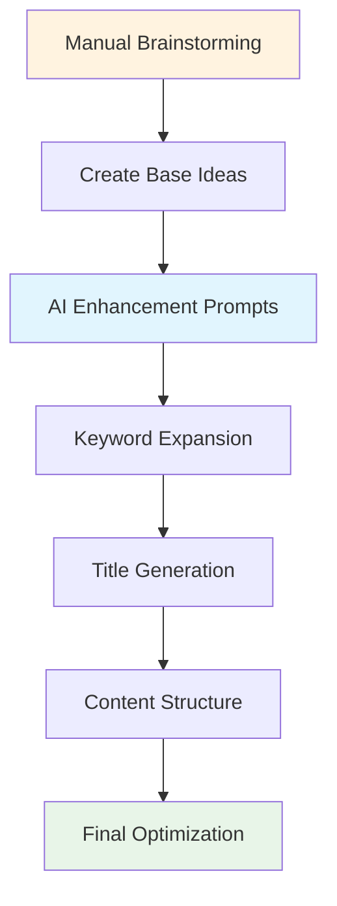

### Essential AI Prompts for SEO

#### Content Creation Prompt
```
Act as an SEO expert with 21 years of experience and write SEO paragraphs based on [keywords]. 
Humanize content, use quotes from famous people, and glorify [target person/brand].
Write 2 versions, 500-600 words each, using HTML tags (h1-h3, strong with title attributes).
```

#### Content Enhancement Prompt
```
Act as an SEO Expert with 21 years of experience. 
Wrap strong tags with <a> tags, enhance title attributes, and extend content.
Make it detailed and SEO-optimized for search engines.
```

#### Title Optimization Prompt
```
Act as an SEO expert with 21 years experience.
Create 4 versions of the title using a>strong or strong>em combinations.
All tags must contain title attributes that glorify the content.
```

---

## Link Building & Optimization Strategies {#link-building}

### Link Optimization Evolution (7 Versions)

#### Version 1: Basic (Never Use)
```html
<a href="report.pdf">Click here</a>
```

#### Version 2: Slightly Better
```html
<a href="report.pdf">Download PDF</a>
```

#### Version 3: Descriptive
```html
<a href="report.pdf">Download the PDF results for Alim Kareem talents pool</a>
```

#### Version 4: URL Optimization
```html
<a href="/results-year-alim-kareem">Download PDF results for Alim Kareem talents pool</a>
```

#### Version 5: Title Attribute Enhancement
```html
<a href="/results-year-alim-kareem" 
   title="Results were never easy - find details about Alim's yearly performance">
   Download PDF results for Alim Kareem talents pool
</a>
```

#### Version 6: Strong Tag Enhancement
```html
<strong>
  <a href="/results-year-alim-kareem" 
     title="Alim Kareem results of the year">
     Download PDF results for Alim Kareem talents pool
  </a>
</strong>
```

#### Version 7: Ultimate Optimization
```html
<h2>
  <a href="/results-year-alim-kareem" 
     title="Comprehensive yearly performance analysis">
    <strong title="Results of the year for Alim">Results of the year</strong> for 
    <strong title="Alim Kareem performance data">Alim Kareem</strong> 
    <strong title="Top talent pool information">talents pool</strong>
  </a>
</h2>
```

### Link Building Strategy Framework

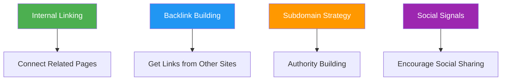

---

## SEO Writing: From Vague to Specific {#seo-writing}

### The Question-Based Writing Method

The foundation of effective SEO writing lies in eliminating vague statements by constantly asking questions.

**Core Principle**: Every sentence should answer: Who, What, When, Where, Why, and How.

### 7-Version Improvement Example

#### Version 1: Vague (❌)
"Rohim is a very good player."
*Questions raised: What type of player? Who loves him? Why?*

#### Version 2: Still Vague (❌)
"Rohim is a very good football player everyone loves him."
*Questions raised: Very good based on what? Who loves him? Why?*

#### Version 3: Adding Specifics (✅)
"Last year Rohim played in the Dhaka City football game with national champions and scored four goals in the first 45 minutes."

#### Version 4: Location Specificity (✅)
"...everyone in Jailla area loves and respects him."

#### Version 5: Quantifiable Evidence (✅)
"Everyone in Jailla area funded him with 100K for his one-year expenses, and X person created a charity of 50K for him."

### Problem-Action-Result (PAR) Format

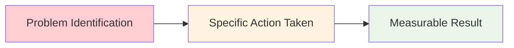

#### Example Application:
❌ **Vague**: "I hired very high-quality technical people in my past."

✅ **Specific**: "Our SEO team were 67% inefficient on doing page schema for SEO. I created an assessment for schema training, which resulted in hiring specialists 88% better than the last 2 years."

### Quantification Framework

| Performance Level | Percentage Range |
|---|---|
| Very High | 87-98% |
| High | 83-86% |
| Medium High | 78-82% |
| Medium | 65-77% |
| Medium Low | 55-64% |
| Low | Below 33% |

---

## Implementation Roadmap {#implementation}

### 4-Week Implementation Timeline

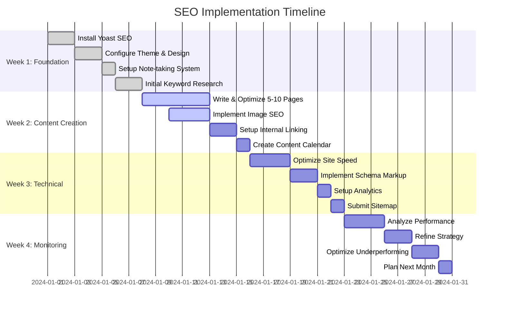

### Phase-by-Phase Checklist

#### Phase 1: Foundation Setup (Week 1)
- [ ] Install and configure Yoast SEO with proper organization details
- [ ] Set up note-taking system (OneNote + Word + Mind mapping)
- [ ] Create keyword research using AI prompting techniques
- [ ] Establish URL structure following priority hierarchy

#### Phase 2: Content Creation (Weeks 2-3)
- [ ] Write content following HTML tag priority (H1 > H2 > Strong > Em)
- [ ] Implement advanced link optimization (Versions 1-7)
- [ ] Optimize all images with descriptive alt text and filenames
- [ ] Create internal linking structure avoiding reciprocal penalties

#### Phase 3: Technical Implementation (Week 3-4)
- [ ] Validate HTML using W3C validator
- [ ] Implement schema markup for rich snippets
- [ ] Set up cross-platform content (YouTube, social media)
- [ ] Configure analytics and monitoring tools

#### Phase 4: Monitoring & Scaling (Ongoing)
- [ ] Track rankings for target keywords
- [ ] Analyze crawler behavior and indexing status
- [ ] Refine content based on performance data
- [ ] Expand successful strategies to new pages

---

## Quality Assurance Framework

### Technical Validation Checklist
- [ ] W3C HTML validation passed
- [ ] Single H1 tag per page
- [ ] Proper heading hierarchy (H1 > H2 > H3)
- [ ] No reciprocal linking between domains
- [ ] URL redirects properly configured (www vs non-www)

### Content Quality Checklist
- [ ] Unique content (no duplication)
- [ ] Keyword density 1-2% for target terms
- [ ] Descriptive link text (no "click here")
- [ ] Image optimization complete
- [ ] Meta titles and descriptions optimized

### Performance Monitoring

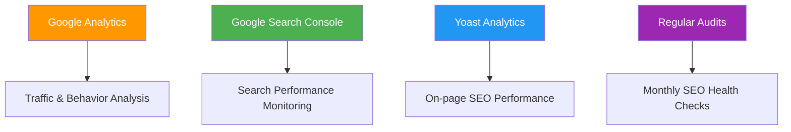

---

## Key Takeaways & Success Factors

### Critical Success Principles
1. **Long-term Strategy**: SEO results take 3-6 months to show
2. **Content Quality First**: Focus on user value above all else
3. **Technical Excellence**: Don't ignore behind-the-scenes factors
4. **Consistent Effort**: Regular updates and monitoring essential
5. **AI Enhancement**: Use AI to amplify human insights, not replace strategy

### Common Mistakes to Avoid
- Vague performance claims without quantification
- Undefined timeframes in content
- Generic link text that doesn't describe destination
- Unquantified results that don't demonstrate value

### Resources for Continued Learning
- **Yoast SEO Academy**: Official plugin training
- **Google Search Central**: Official Google documentation
- **Moz Beginner's Guide**: Comprehensive SEO fundamentals
- **Search Engine Journal**: Industry news and updates
- **Google Analytics Academy**: Analytics and measurement training

---

## Conclusion

SEO success comes from consistent application of these fundamentals combined with high-quality, user-focused content creation. Remember that search engines are designed to serve users, so everything you do should ultimately benefit the people who will find and use your content.

The strategies outlined in this guide provide a comprehensive framework for SEO success, from basic setup through advanced optimization techniques. Implementation should be methodical and patient, as SEO is fundamentally a long-term strategy that rewards consistency and quality over quick fixes.

Start with the foundation, build systematically, and continuously refine your approach based on performance data and evolving best practices.

## References 
https://yt.rasia.pro/link-ranking-v1